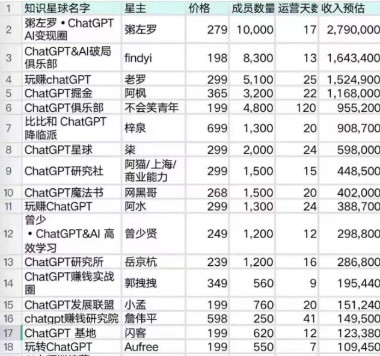
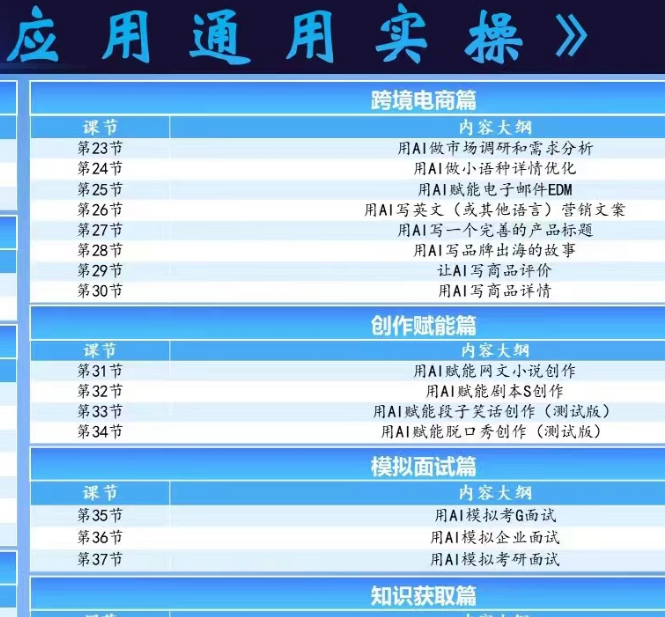
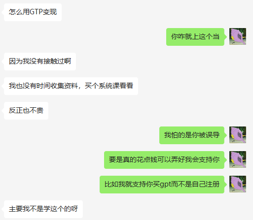
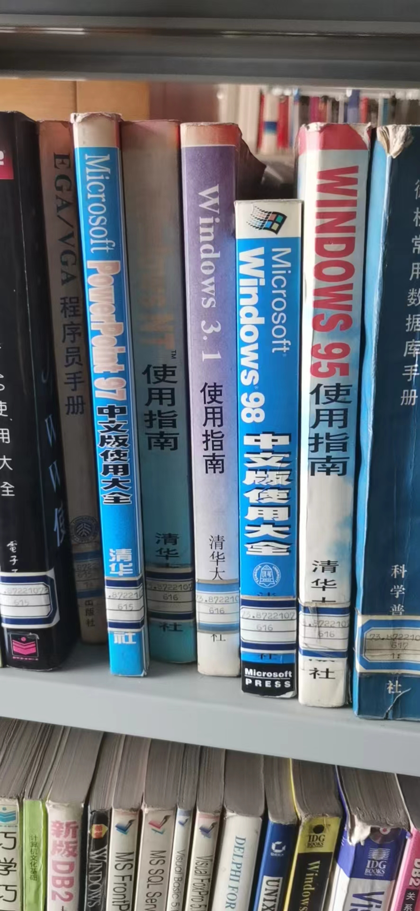
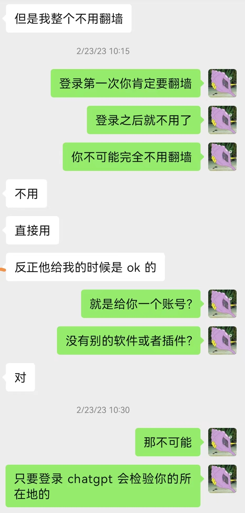
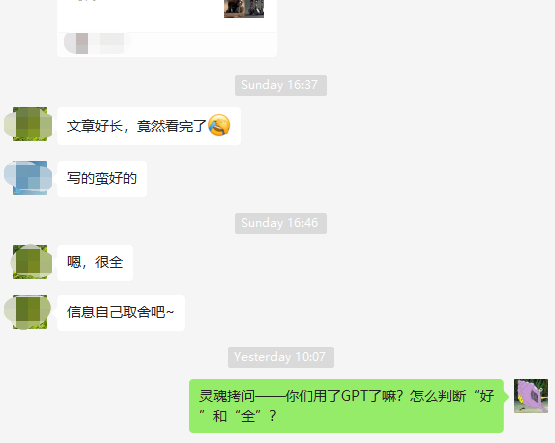

# 学习“学习”ChatGPT

现在ChatGPT的各方面内容越来越多，消息让人应接不暇。

## 学习GPT市场

现在看见外面很多人卖使用GPT的课，并且报名交钱的人不少，不早点报名还会涨价

很多培训学校已经在教你如果使用GPT做各种事了

并且随着时间的推移，应该会有更多的这类课程出现

## 我的观念转变

我最初的看法是，在这上面（学习使用GPT）花钱就是上当

但是跟我一个文科的校友交流之后，我改变了我的看法

> 她连GPT都打错了

因为我从事的就是技术工作，周围的人大部分都是做机器学习和深度学习的，他们自然觉得为啥还要给学习GPT花钱

可是，还记得电脑刚开始普及时候吗？不要说学习Office了，学习Windows都要花钱

我问了一下，那么多节课的网课，也就600左右，对于一个根本不懂GPT的人来说，其实就跟当初学习Windows无异，花点钱马上学会，比自己折腾好半天学不会好很多

包括我上一次说的400买山寨GPT的同学，他买的虽然是套壳的GPT，但是真的至少让他用上了GPT！我觉得他这个钱没有白花

## 结语

首先，铺天盖地的GPT会让好多人失业，但是GPT还没来得及让人失业，结果很多人用GPT赚钱了，甚至有人赚到财富自由了

其次，以后使用GPT这类AI，估计会跟现在人人都会用电脑一样普及，拥抱变化吧！

最后，不要停留在观望，马上行动吧，不亲自操作一遍很容易被人误导

现在接触的各个群里，总是能看见很多人对GPT的评价，但是到底多少人是真的用过了GPT去客观评价了呢？

对于一个写文章的人来说，一定要抛出一些劲爆的内容，很多时候根本不在乎真实，但是我们生活的世界是真实的！

