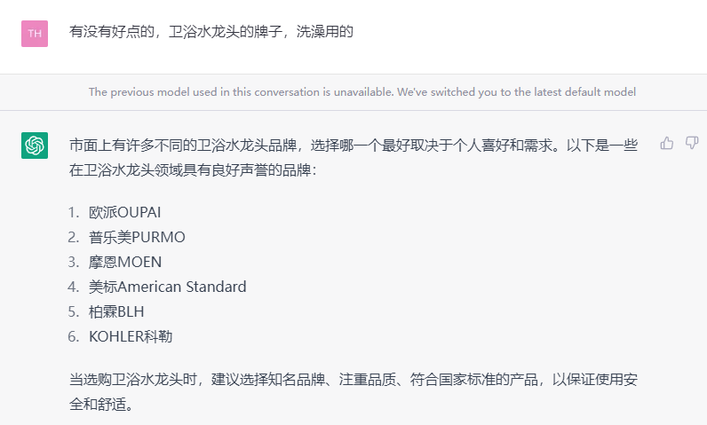
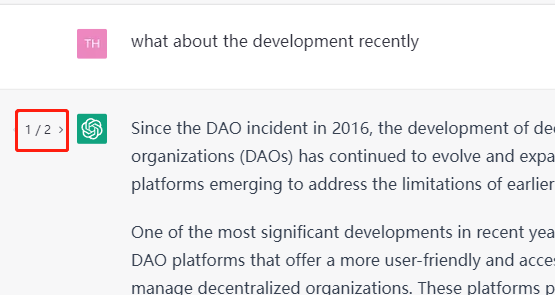
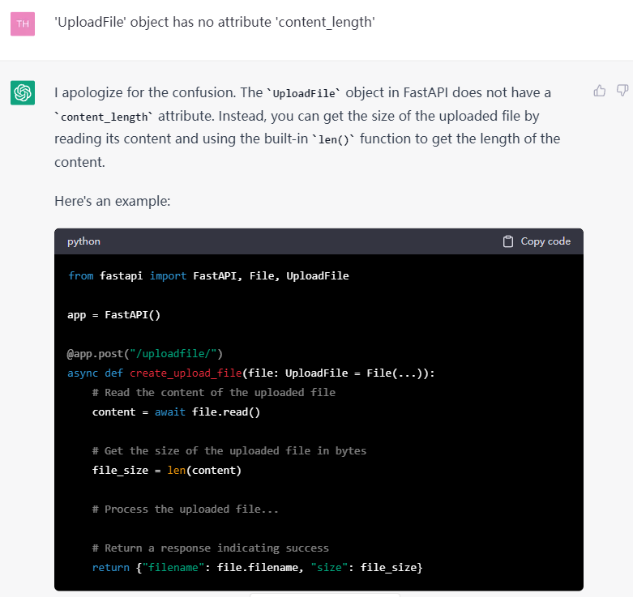
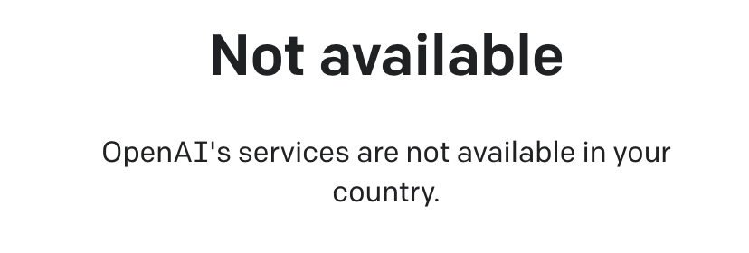
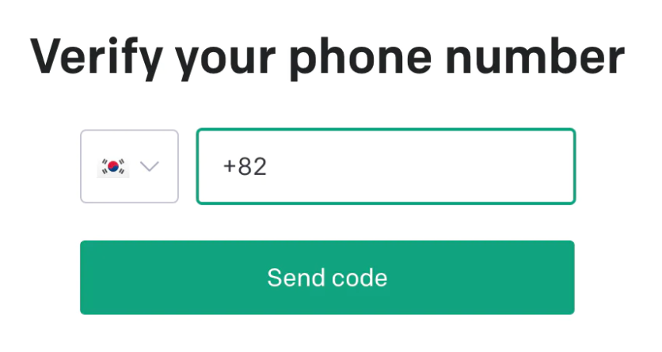
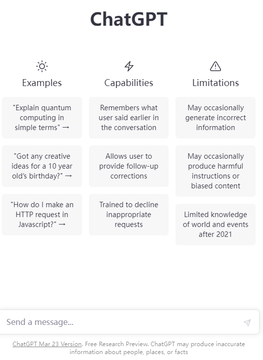
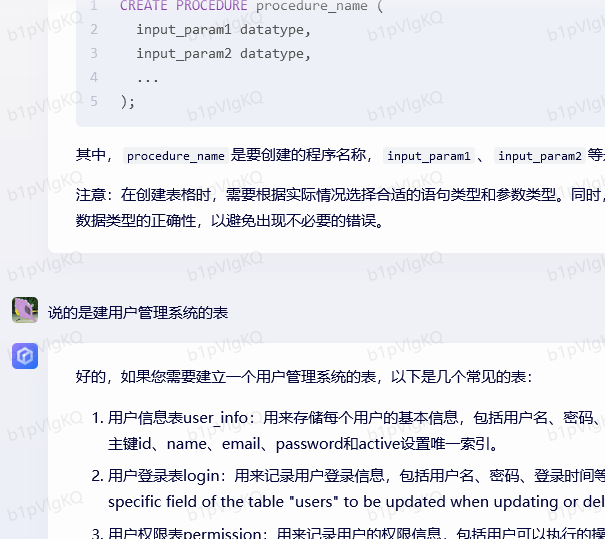
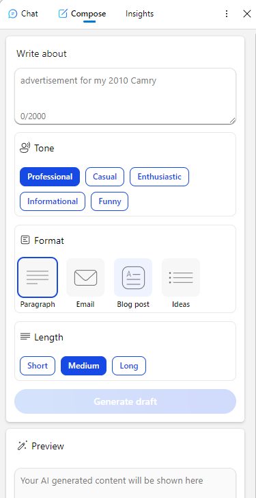
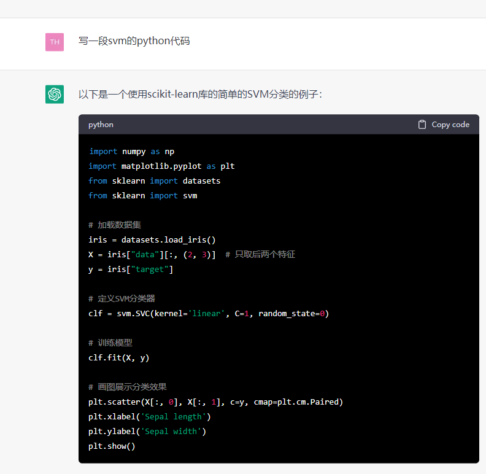
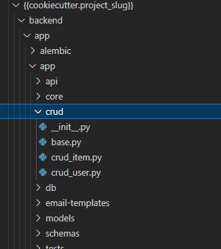

# GPT体验报告

去年开始openai发布了chatGPT，我是第一波使用的用户，并且已经将其应用在了工作之中。在此，发表一些自己的见解

1. 体验报告
2. 如何使用GPT
3. 文心一言评价
4. GPT是否会让程序员失业

## 1.体验报告

### 日常问答

- 比如我我买个水龙头

- 比如我想听个笑话

> 可惜“那样的笑话”不会讲

### 最让我惊讶的是可以把前后的话连贯下来，继续问，这一点非常棒

### 我的工作需要写论文和写代码，GPT对于我来说简直如鱼得水

- 因为GPT有连贯性，我可以一直追问到我想要的内容，并且不满意的还可以重复问，GPT的两次回答都不会重复

- 很多人都见识过GPT写代码了，这里说个程序员才会体会的事情，那就是开发1天，调bug2天！之前调bug遇到问题就是在*百度*搜，高级一点的在*StackOverFlow*，遇到困难的问题可能要反复找很多次，现在只要问GPT就行！最重要如果对回答不满意，可以修正后追问，GPT自己还能体会到之前给你的回答不好，她会帮你找答案！极大的缩短了debug时间，让开发更高效

## 2.如何使用GPT

1. 因为GPT限制了国内访问

所以第一步要买个**翻墙**软件，选一个国外的地址。我用的https://www.0dyms.com/

> 注意，香港澳门也不能使用

2. 注册时候，需要用国外的手机号，所以需要买一个虚拟运营商电话，然后接收短信。我用的https://sms-activate.org

> 一般推荐使用印度的手机号，便宜，成功率高

3. 注册成功之后马上可以使用

**对于还没有GPT的童鞋，我建议直接买账号，因为过程很繁琐，反正也要买虚拟电话。**

但是，千万不要买到假的，记住唯一域名https://chat.openai.com/chat

下面是一个悲伤的故事

## 3.文心一言评价

首先，我挺文心一言，我认为完全可以作为GPT的替代品，尤其是中文方面很多比GPT好，还拥有GPT3.5没有的绘图功能

别总揪住*文心一言*的错误不放,GPT一样有错误，其实最大的问题是连贯性差

> 我之前说过GPT问的问题是不间断的，第二句话是可以根据第一句话的延伸，但是文心一言很多时候需要你重新带着第一句话的问题问，才能得到你想要的答案

最重要，*文心一言*不用翻墙啊，这点不香吗？很多人成天只看GPT的新闻，根本就没体验过，就大放厥词

## 4.GPT是否会让程序员失业

先说结论————**不能**

1. 首先，需要底层执行人员

GPT影响最大的应该是文字工作者，任何人都会说话，但是可能说的不够好，用GPT以及相关的衍生产品，可以马上组织文字

> Bing应用了GPT的API，可以马上写文字，并且可以选择方式和口吻

但是文字工作者会失业吗？比如公司要有个文案，确实GPT可以帮助写文案，但是如果开了文案，那么谁来用GPT写文案？

同理，开了程序员谁去写代码？

2. 其次，写代码有一定的门槛

让GPT写了一段非常简单的Python代码，SVM的示例

> 不会代码的人看了之后，知道怎么运行吗？别说运行，知道要创建*.py文件吗？
> 有一定程序基础的，但是没学过Python的知道怎么加载库吗？

很多人说啥对高级程序员没啥影响，初级影响很大。

我认为，对中级影响很大，因为一旦入门之后，用GPT非常轻松可以搞定一些自己没做过的代码

但是，初级恰恰完全没影响，因为需要有人写代码，上一条说过，另外一个就是程序员有比较高的门槛！问GPT要了文字，你马上会用，但是告诉你了代码，你也不会执行！

3. 最后，也是最重要的，GPT只能提供一个片段，没法提供一个完整的项目

一个项目，哪怕最简单一个项目，也是拥有多个代码片段完成的

> 每一个文件可能都是多个代码片段的组合，更不要说整个项目了

## 总结

GPT给了大家很大的便利，工作效率能提升很多

好好拥抱变化才是真的，不要成天散播不实信息

要想发表看法，最起码先体验过再说，网上大部分都是根本不会用GPT的人就在胡说八道

新事物出现时候，骗子也出现了，千万不要上当
